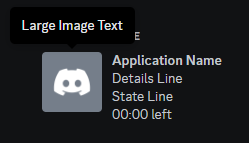

# DiscordGame

Добавляет **Launcher'у** интеграцию с *Discord'ом*. То есть, при наличии *Discord'а* на компьютере игрока, запустившего
один из ваших игровых клиентов, в его аккаунте *Discord'а* будет показывать, что он играет именно у вас

---

## Установка модуля

1. Скопировать модуль **DiscordGame_lmodule.jar** в папку **/LaunchServer/launcher-modules/**
2. Скачать последнюю версию библиотеки **[discord-game-sdk4j-0.5.x.jar]**
3. Библиотеку **discord-game-sdk4j-0.5.x.jar** поместить в папку **/LaunchServer/launcher-libraries/**
4. Добавить в папку **/LaunchServer/launcher-pack** следующие файлы из архива **[Discord Game SDK 2.5.6 ZIP]**:
- Файл `lib/x86/discord_game_sdk.dll` в `native/windows/x86/discord_game_sdk.dll`
- Файл `lib/x86_64/discord_game_sdk.dll` в `native/windows/amd64/discord_game_sdk.dll`
- Файл `lib/x86_64/discord_game_sdk.so` в `native/linux/amd64/discord_game_sdk.so`
- Файл `lib/x86_64/discord_game_sdk.dylib` в `native/macos/amd64/discord_game_sdk.dylib`

---

## Настройка модуля

#### Конфигурационный файл с комментариями:
```json
{
  "enable": true,
  "appId": 810913859371532298,
  "scopes": {
    "login": {
      "details": "Лучший проект Minecraft",
      "state": "Авторизуется",
      "largeImageKey": "large",
      "smallImageKey": "small",
      "largeImageText": "Everything",
      "smallImageText": "Everything"
    },
    "authorized": {
      "details": "Лучший проект Minecraft",
      "state": "Выбирает сервер",
      "largeImageKey": "large",
      "smallImageKey": "small",
      "largeImageText": "Everything",
      "smallImageText": "Everything"
    },
    "client": {
      "details": "Лучший проект Minecraft",
      "state": "Играет на %profileName%",
      "largeImageKey": "large",
      "smallImageKey": "small",
      "largeImageText": "Everything",
      "smallImageText": "Everything"
    }
  }
}
```
- `details` - Первая строка состояния, после имени приложения
- `state` - Вторая строка состояния, после имени приложения
- `largeImageKey` - Имя главной картинки (Допускается ссылка URL на PNG больше 512x512)
- `smallImageKey` - Имя вторичной, миниатюрной картинки (Допускается ссылка URL на PNG больше 512x512)
- `largeImageText` - Текст большой картинки
- `smallImageText` - Текст вторичной, миниатюрной картинки

**Копировать не рекомендуется!**

### Немного пояснений:
- Имя приложения, отображается как название игры!
- `scopes -> login` - Отображается при загрузке лаунчера, без данных пользователя
- `scopes -> authorized` - Отображается после авторизации в лаунчере
- `scopes -> client` - Отображается после запуска клиента игры
- 
- `%profileName%` - это плейсхолдер, заменяющий собой, имя запущенного клиента (больше плейсхолдеров ниже)

### Получаем "APPLICATION ID":
1. Заходим на сайт: https://discord.com/developers/applications
2. Создаём новое приложение
3. Копируем `APPLICATION ID` в `appId` конфигурации модуля

### Отображение аватара пользователя
1. Убедитесь что у вас есть скрипт, отдаваемый в разрешении 512x512 аватар скина
2. Работает только в `scopes -> authorized` и `scopes -> client` на поля `largeImageKey`, `smallImageKey`, из-за заполнителя `%username%`
3. Ваша ссылка не должна превышать с плейсхолдером пользователя: `%username%` - 127 байтов. (Можно исправить исходники **[discord-game-sdk4j-0.5.x.jar]**, если очень надо)

### Своя картинка, под каждый профиль:
1. В `largeImageKey` или `smallImageKey` в `scopes -> client` вставляем один из плейсхолдеров: `%profileUUID%` или `%profileHash%`
2. Называем изображение профиля, соответствующему ему UUID или Hash

### Как загрузить необходимое изображение:
1. Переходим в настройки вашего приложения на сайте: https://discord.com/developers/applications
2. Переходим в раздел "Rich Presence" и попадаем сразу на "Art Assets"
3. Нажимаем на кнопку "Add Image(s)" и загружаем необходимые вам изображения
4. Переименовываем загруженные изображения в более удобный вид (Не обязательно)

**Модуль игнорирует App Icon вашего приложения!**

---

## Все плейсхолдеры:

- `%uuid%` - UUID пользователя
- `%profileVersion%` - Версия профиля
- `%profileName%` - Имя профиля (title)
- `%profileUUID%` - UUID профиля
- `%profileHash%` - Hash профиля (UUID без `-`)
- `%username%` - Имя пользователя
- `%launcherVersion%` - Версия лаунчера
- `%javaVersion%` - Версия используемой Java
- `%javaBits%` - Разрядность используемой Java
- `%os%` - Операционная система

[discord-game-sdk4j-0.5.x.jar]: https://github.com/JnCrMx/discord-game-sdk4j/releases

[Discord Game SDK 2.5.6 ZIP]: https://dl-game-sdk.discordapp.net/2.5.6/discord_game_sdk.zip
