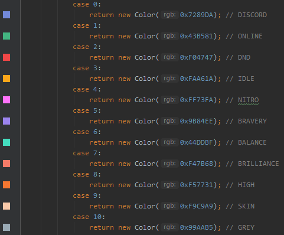

# DiscordIntegration

Добавляет **LauncherServer'у** интеграцию с *Discord'ом*. То есть станет доступным удаленное управление лаунчером из
дискорд канала, а также логируется авторизация через лаунчер.

#### Установка модуля

1. Скопировать модуль **DiscordIntegration_module.jar** в папку **/LaunchServer/modules/**
2. Скачать библиотеку *[jda]* и положить в папку **/LaunchServer/libraries/**:
3. Скачать библиотеку *[log4j-api]* и положить в папку **/LaunchServer/libraries/**:
4. Выполнить настройку конфигурации:
    - */LaunchServer/config/DiscordIntegration/Config.json*

- `"logAuth": true` - Логировать авторизацию пользователей.
- `"profilesEnable": true` - Отображение профилей. // Не работает на 5.2.0+
- `"avatarEnable": true` - Отображение головы в логах.
- `"prefix": "!"` - Префикс команд.
- `"url": "https://minotar.net/cube/user/%s.png"` - ссылка на API для возвращения картинки головы.
- `"token": "MY_TOKEN"` - токен бота.
- `"channelID": "CHANNEL_ID"` - ID канала для работы с ботом.
- `"adminOnly": true` - выполнять команды только от пользователей с правами Администратора.
- `"colorRun": 1` - Цвет Embed запуска лаунчера [0 - 10]
- `"colorAuth": 8` - Цвет Embed авторизации в лаунчере [0 - 10]

```json
{
  "logAuth": true,
  "profilesEnable": true,
  "avatarEnable": true,
  "prefix": "!",
  "url": "https://minotar.net/cube/user/%s.png",
  "token": "MY_TOKEN",
  "channelID": "CHANNEL_ID",
  "adminOnly": true,
  "colorRun": 1,
  "colorAuth": 8
}
```

#### Example:

#### Log:


#### Commands:


#### Colors:



[jda]: https://github.com/DV8FromTheWorld/JDA/releases/download/v4.2.0/JDA-4.2.0_168-withDependencies-min.jar
[log4j-api]: https://repo1.maven.org/maven2/org/apache/logging/log4j/log4j-api/2.14.1/log4j-api-2.14.1.jar