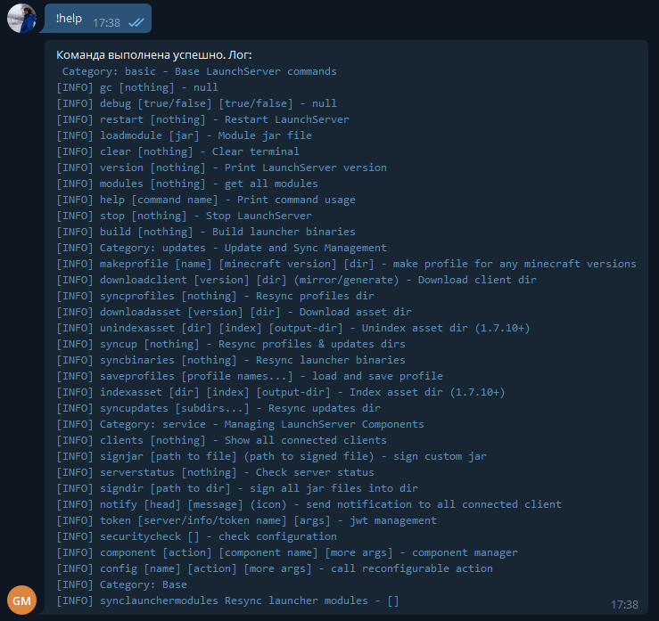
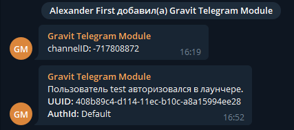

# TelegramBotConsole

Позволяет управлять лаунчсервером удаленно через Telegram бота

#### Установка модуля

1. Скопировать модуль **TelegramBotConsole_module.jar** в папку **/LaunchServer/modules/**
2. Скачать и положить в `libraries`
   библиотеку https://repo1.maven.org/maven2/org/telegram/telegrambots/6.0.1/telegrambots-6.0.1.jar
3. Создать бота в панели управления разработчика https://t.me/botfather и скопировать его токен
4. Настроить конфигурацию

#### Описание работы

Модуль поддержки работы с LaunchServer через Telegram. Модуль позволяет выполнять команды в консоли серверной стороны
лаунчера через диалог, а также получать уведомления о различных событиях в чат или личные сообщения.

#### Конфигурация

```json
{
  "token": "TOKEN",
  "botUsername": "@bot_username",
  "prefix": "!",
  "channelID": "",
  "allowUsers": [
    "test",
    "123456"
  ],
  "events": {
    "login": true,
    "checkServer": true
  }
}
```

- **token**: ваш токен бота
- **bot_username**: имя вашего бота
- **prefix**: префикс команд
- **channelID**: чат для уведомлений (опционально)
- **allowUsers**: ID или логин пользователей, которым разрешено выполнять команды
- **events**: События, о которых вас будет уведомлять бот

Примеры:

